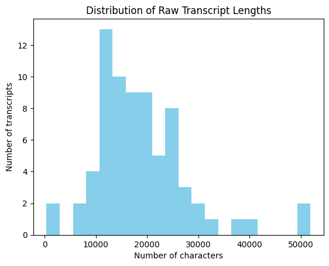
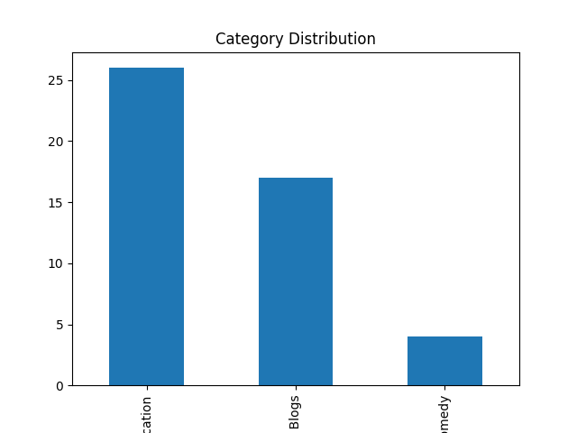

# NLP Project Milestone 1 Report – Data Analysis and Preprocessing

## 1. Introduction

**Objective:**  
This milestone focuses on exploring, cleaning, and preprocessing the dataset to prepare it for downstream NLP tasks such as text classification and topic modeling. Our dataset comprises 73 YouTube transcripts written in Arabic, featuring both Modern Standard Arabic (MSA) and Egyptian dialect elements. This report details our exploratory data analysis (EDA) and preprocessing pipeline, and discusses the insights gained and limitations encountered. 

**Our Approach and Rationale:**  
In our project, we decided to pursue a classification task focused on categorizing the transcripts. We selected this task because it allows us to leverage both metadata and textual content in a complementary way. Specifically, we use the channel information—which often provides context about the source and style of the content—as well as the most common words extracted from the transcripts. This combination helps capture not only the inherent topics within the text but also the contextual signals associated with specific channels. 


**Dataset Overview:**  
- **Number of Transcripts:** 73  
- **Metadata:** Each transcript comes with a title, channel, and category (with one transcript missing a category).  
- **Language Characteristics:** The text contains a mix of MSA and Egyptian dialect, with varying transcript lengths and diacritization levels.

---

## 2. Exploratory Data Analysis (EDA) – Raw Data

### 2.1 Data Structure and Quality
- **Data Overview:**  
  We used `df.info()` to confirm that our DataFrame contains 73 rows and 4 columns (title, channel, category, transcript).  
- **Missing Values:**  
  One transcript is missing a category, which will be handled in later stages.  
- **Duplicates:**  
  We checked for duplicate records to ensure data quality.

### 2.2 Descriptive Statistics
- **Transcript Length:**  
  We computed the raw length (number of characters) of each transcript. The lengths range from 930 to 51,920 characters, with a mean of approximately 21,778 characters. This variability suggests the need for normalization or segmentation of very long texts.
  
  ```python
  df['raw_length'] = df['transcript'].apply(len)
  print(df['raw_length'].describe())
  ```
  

### 2.3 Metadata Analysis
- **Category Distribution:**  
  We visualized and analyzed the distribution of transcripts across different categories. This revealed potential class imbalances.
  
  ```python
  print(df['category'].value_counts())
  df['category'].value_counts().plot(kind='bar', title="Category Distribution")
  plt.xlabel("Category")
  plt.ylabel("Count")
  plt.show()
  ```
  

- **Analyzing Transcript Distribution Across Channels:**  
The distribution of transcripts across channels were as follows:
- B Hodoo2                  26
- al mokhbir al eqtisadi    25
- Kefaya Ba2a               21


### 2.4 Preliminary Text Analysis
- **Raw Text Sampling:**  
  We randomly sampled a few transcripts to inspect for encoding issues, extraneous whitespace, and formatting inconsistencies.
  
  ```python
  print(df['transcript'].sample(5))
  ```
  
- **Word Frequency:**  
  A basic word frequency analysis on the raw text provided insight into the most common terms and helped us design a custom stopword list.
 
 The top 10 most common words in raw transcripts:
 [('في', 5726), ('انا', 3823), ('ما', 3330), ('اللي', 3253), ('ده', 2993), ('انت', 2853), ('من', 2737), ('ان', 2699), ('هو', 2628), ('يعني', 2494)]

- **Category-Specific Top Words:**
To further understand the nuances of each category, we computed the most common words for each category.
The output was:  

 Category: Education  
  في: 3018
  انا: 2115
  اللي: 1838
  ان: 1789
  من: 1780  

Category: People & Blogs  
  في: 2135
  انت: 1332
  انا: 1327
  ما: 1285
  هو: 1259  

Category: Comedy
  في: 573
  ما: 399
  يا: 391
  انا: 381
  انت: 364

- **Viewing categories of each channel**  
We also inspected the different categories found in each channel  
The output was:
Channel: B Hodoo2  
Number of categories: 1  
Categories: ['Education']  
Channel: Kefaya Ba2a  
Number of categories: 2  
Categories: ['People & Blogs' 'Comedy']  
Channel: al mokhbir al eqtisadi  
Number of categories: 1  
Categories: ['Entertainment ']

- **Purpose of Raw EDA:**  
This initial analysis helped us understand the dataset's structure, quality, and linguistic characteristics, which in turn guided our decisions for the preprocessing pipeline.


---

## 3. Preprocessing Pipeline

Our preprocessing pipeline transforms the raw transcripts into a consistent, noise-reduced format for effective feature extraction.

### 3.1 Cleaning and Normalization

- **Normalization of Arabic Letters:**  
  We normalized variants of letters (e.g., converting "أ", "إ", "آ" to "ا") to reduce vocabulary variability.
  
- **Punctuation and Whitespace Cleaning:**  
  Extraneous punctuation was removed, and whitespace was standardized.

### 3.2 Tokenization
- **Tokenization with Farasa:**  
  We used Farasa for advanced tokenization, which handles clitics and morphological segmentation in Egyptian dialect.
  
- **Post-Processing:**  
  After tokenization, we removed segmentation markers (e.g., plus signs) to yield cleaner tokens.
  


### 3.3 Stopword Removal

Initially, we applied NLTK’s Arabic stopword list—which is based on Modern Standard Arabic—to our tokenized text. This initial removal reduced the average token count per document. For example, across our dataset, the mean total tokens per document were 3684, and after applying the initial stopword removal, the mean token count dropped to 2822 The results of this initial stage are summarized in the table below:

| Mean total tokens | Mean tokens after initial stopword removal |
|-------------------|----------------------------------------------|
| 3684       | 2822                                  |

However, our subsequent TF-IDF analysis revealed that Egyptian dialect stopwords (e.g., "اللي") were still present. To further refine the process, we performed a statistical analysis by calculating document frequency and selecting the top 5% most frequent words as additional stopwords, supplementing them with manually added terms. This further reduction brought the mean token count down to 1277 per document. The table below summarizes the progressive reduction across all stages:

| Mean total tokens | Mean tokens after initial stopword removal | Mean tokens after additional stopword removal |
|-------------------|----------------------------------------------|-------------------------------------------------|
| 3684       | 2822                                 | 1277                                   |

This two-stage approach to stopword removal allowed us to progressively filter out uninformative tokens, ultimately leading to a more expressive feature set for our downstream tasks.


### 3.4 Stemming and Lemmatization

In this section, we compare two approaches for morphological normalization: stemming and lemmatization. Our objective was to reduce vocabulary size while preserving semantic content for improved downstream performance in a text classification task.

**Methodology and Manual Inspection:**  
- **Stemming:** We applied the ISRIStemmer on the tokens (after additional stopword removal) to reduce them to their root forms. Manual inspection of a representative document shows that the stemming process aggressively reduces token forms, resulting in a more compact and normalized output.  
- **Lemmatization:** Using the CAMeL Tools Analyzer, we lemmatized the same set of tokens. This method retained more of the original word forms, capturing finer semantic nuances, but at the cost of a larger vocabulary.

**Manual Inspection**
For example, for one document:  
- The **original tokens** (after additional stopword removal) included words such as `['الانتاجيه', '500', 'قناه', 'وبحسبه', ...]`.  
- The **stemmed tokens** were significantly abbreviated (e.g., `['ناج', '500', 'قنه', 'حسب', ...]`).  
- The **lemmatized tokens** preserved more of the original form (e.g., `['الانتاجيه', '500', 'قناه', 'وبحسبه', ...]`).

**Vocabulary Size Comparison:**  
When we computed the vocabulary for the tokens after additional stopword removal, we obtained **35,014** unique tokens.Some of the most frequent tokens in this set were:
- ('الإنسان', 338)
- ('وأنا', 310)
- ('وأنت', 232)
- ('فأنا', 187)
- ('الآخر', 176)
- ('لالله', 171)
- ('أقول', 162)
- ('أكبر', 158)
- ('أعمل', 150)

After applying stemming, the vocabulary was significantly compressed to **10,109** unique tokens, whereas lemmatization did not affect the vocabulary size. This indicates that stemming offers a more compact representation.

**Baseline Model Evaluation:**  
We integrated both approaches into a baseline text classification pipeline using TF-IDF features and a logistic regression classifier. The evaluation metrics for both pipelines were nearly identical:
- **Accuracy:** 86.67%
- **Precision (weighted):** 88.83%
- **Recall (weighted):** 86.67%
- **F1-score (weighted):** 85.04%

The confusion matrices and detailed classification reports were also similar between the two methods.

**Conclusion:**  
Given that both stemming and lemmatization achieve comparable predictive performance, the choice between them comes down to efficiency and feature space compactness. Stemming significantly reduces the vocabulary size, which:
- Lowers computational complexity and speeds up training,
- Minimizes the risk of overfitting (particularly important given our relatively small dataset), and
- Streamlines the feature space without sacrificing classification accuracy.

Based on these results, our pipeline will favor **stemming** as the preferred approach for morphological normalization.


## 4. Post-Preprocessing Analysis

After applying our stemming-based preprocessing pipeline, we generated a TF-IDF matrix from the processed text. Specifically, we converted the stemmed tokens into document strings and used a TF-IDF vectorizer with a maximum of 5000 features and an n-gram range of (1,2). The resulting matrix had a shape of **(72, 5000)**, corresponding to 72 documents with 5000 features each.

### 4.1 TF-IDF Analysis per Document

We then inspected the highest scoring words for individual documents to assess the quality of the TF-IDF features. For instance, in one document related to a video discussing the pain from love relationships, negative emotions, and the loss of motivation, the top TF-IDF scores were:
- **سقط:** 0.1924  
- **الم:** 0.1862  
- **اجتماعيه:** 0.1602  
- **دعم:** 0.1520  
- **نكد:** 0.1510  

These results indicate that the document’s emotional and relational content is being captured effectively.

In another document which discusses aspects of career life, the highest scoring words were:
- **هترضى:** 0.2264  
- **وأن:** 0.1822  
- **كارير:** 0.1806  
- **شغل:** 0.1674  
- **كورس:** 0.1550  

Although one of the high-scoring terms is a residual stopword ("وأن"), the presence of words such as **كارير** and **شغل** shows that the TF-IDF features still capture relevant domain-specific information for career-related content.

Overall, these findings suggest that our preprocessing pipeline is effective in extracting meaningful features from the text, despite minor issues (like a few stopwords persisting).


### 4.2 TF-IDF Analysis per Category

We further examined the TF-IDF matrix on a per-category basis by generating separate TF-IDF representations for each category. This allowed us to inspect the highest scoring words and assess whether the features captured are semantically aligned with the content of each category.

**Observations:**

- **Education:**  
  The top scoring words include:
  - **عمل:** 0.1056  
  - **وأن:** 0.0922  
  - **انس:** 0.0889  
  - **علم:** 0.0604  
  - **فكر:** 0.0548  

  Notably, the term **علم** (knowledge) appears among the highest scoring words, which is fitting for educational content.

- **People & Blogs:**  
  The top terms are:
  - **عمل:** 0.0806  
  - **كلب:** 0.0561  
  - **فطر:** 0.0551  
  - **اكل:** 0.0517  
  - **وأن:** 0.0507  

  Here, the presence of **وأن**—a residual stopword—suggests that further refinement of the stopword list might be beneficial for this category.

- **Comedy:**  
  The highest scoring words include:
  - **لعب:** 0.2207  
  - **ريض:** 0.1605  
  - **مسم:** 0.1152  
  - **عمل:** 0.1085  
  - **حلق:** 0.0953  

  The term **عمل** appears again, indicating that it may be the stem for a variety of related words across categories.

- **Entertainment:**  
  The top scoring words are:
  - **روس:** 0.1052  
  - **امر:** 0.1022  
  - **صنع:** 0.0461  
  - **صين:** 0.0455  
  - **نفط:** 0.0379  

  These terms reflect the geopolitical and economic themes common in entertainment-related content.


Overall, the per-category TF-IDF analysis indicates that while the features are largely reflective of the underlying topics, there is still room for improvement—particularly in further refining the stopword list to remove residual noise (e.g., **وأن**) and in handling common stems like **عمل**. These insights will guide future adjustments to our preprocessing pipeline.


### 4.3 Visualizations


---


## 5. Limitations
- **Dialect vs. MSA:**  
  The use of MSA-based tools for lemmatization may not fully capture the nuances of Egyptian dialect, which can affect the quality of the output.
- **Stopword Removal:**  
  Some high-frequency function words still appear, indicating that further refinement or expansion of the stopword list might be necessary.
- **Dataset Size:**  
  With only 48 transcripts, our findings are based on a limited sample, which may affect the robustness of the results.
- **Morphological Processing Artifacts:**  
  Both stemming and lemmatization may introduce artifacts or lose nuanced meanings, which could impact downstream tasks.

---

## 6. Conclusion and Next Steps

**Summary:**  
We performed a detailed EDA on both the raw and preprocessed data to understand the dataset’s structure, quality, and linguistic characteristics. Our preprocessing pipeline—including cleaning, normalization, advanced tokenization with Farasa, customized stopword removal, and morphological processing (stemming and lemmatization)—has transformed the raw transcripts into a more uniform representation. However, challenges remain, particularly in handling dialectal nuances and further refining the stopword list.

**Next Steps:**  
- **Feature Extraction:**  
  Convert the processed text into numerical features using TF-IDF, word embeddings, or both.
- **Modeling:**  
  Build baseline classification models (e.g., Logistic Regression, SVM) and evaluate their performance.
- **Iteration:**  
  Use insights from error analysis to further refine the preprocessing pipeline, particularly the stopword list and morphological processing steps.
- **Documentation:**  
  Continue to document your methodology, findings, and limitations, as these will be essential for later milestones.


