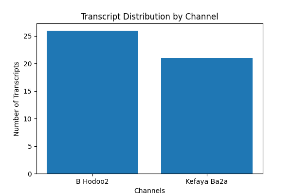

# NLP Project Milestone 1 Report – Data Analysis and Preprocessing

## 1. Introduction

**Objective:**  
This milestone focuses on exploring, cleaning, and preprocessing the dataset to prepare it for downstream NLP tasks such as text classification and topic modeling. Our dataset comprises 48 YouTube transcripts written in Arabic, featuring both Modern Standard Arabic (MSA) and Egyptian dialect elements. This report details our exploratory data analysis (EDA) and preprocessing pipeline, and discusses the insights gained and limitations encountered. 

**Our Approach and Rationale:**  
In our project, we decided to pursue a classification task focused on categorizing the transcripts. We selected this task because it allows us to leverage both metadata and textual content in a complementary way. Specifically, we use the channel information—which often provides context about the source and style of the content—as well as the most common words extracted from the transcripts. This combination helps capture not only the inherent topics within the text but also the contextual signals associated with specific channels. 


**Dataset Overview:**  
- **Number of Transcripts:** 48  
- **Metadata:** Each transcript comes with a title, channel, category (with one transcript missing a category), and additional metrics (e.g., raw character length, diacritic count).  
- **Language Characteristics:** The text contains a mix of MSA and Egyptian dialect, with varying transcript lengths and diacritization levels.

---

## 2. Exploratory Data Analysis (EDA) – Raw Data

### 2.1 Data Structure and Quality
- **Data Overview:**  
  We used `df.info()` to confirm that our DataFrame contains 48 rows and 4 columns (title, channel, category, transcript).  
- **Missing Values:**  
  One transcript is missing a category, which will be handled in later stages.  
- **Duplicates:**  
  We checked for duplicate records to ensure data quality.

### 2.2 Descriptive Statistics
- **Transcript Length:**  
  We computed the raw length (number of characters) of each transcript. The lengths range from 930 to 51,920 characters, with a mean of approximately 21,778 characters. This variability suggests the need for normalization or segmentation of very long texts.
  
  ```python
  df['raw_length'] = df['transcript'].apply(len)
  print(df['raw_length'].describe())
  ```
  

### 2.3 Metadata Analysis
- **Category Distribution:**  
  We visualized and analyzed the distribution of transcripts across different categories. This revealed potential class imbalances.
  
  ```python
  print(df['category'].value_counts())
  df['category'].value_counts().plot(kind='bar', title="Category Distribution")
  plt.xlabel("Category")
  plt.ylabel("Count")
  plt.show()
  ```
  

- **Analyzing Transcript Distribution Across Channels:**  
To understand the distribution of transcripts across channels, we executed the following code:

```python
print(df['channel'].unique())
print(df['channel'].value_counts())
```
The output indicated that there are two channels in the dataset:
B Hodoo2 with 26 transcripts
Kefaya Ba2a with 21 transcripts


### 2.4 Preliminary Text Analysis
- **Raw Text Sampling:**  
  We randomly sampled a few transcripts to inspect for encoding issues, extraneous whitespace, and formatting inconsistencies.
  
  ```python
  print(df['transcript'].sample(5))
  ```
  
- **Word Frequency:**  
  A basic word frequency analysis on lightly cleaned text provided insight into the most common terms and helped us design a custom stopword list.
  
  ```python
  from collections import Counter
  import re

  def simple_clean(text):
      text = text.lower()
      text = re.sub(r'[^\w\s]', '', text)
      return text

  all_text = " ".join(df['transcript'].apply(simple_clean))
  words = all_text.split()
  print("Top 10 words in raw transcripts:", Counter(words).most_common(10))
  ```

*Purpose of Raw EDA:*  
This initial analysis helped us understand the dataset's structure, quality, and linguistic characteristics, which in turn guided our decisions for the preprocessing pipeline.

---

## 3. Preprocessing Pipeline

Our preprocessing pipeline transforms the raw transcripts into a consistent, noise-reduced format for effective feature extraction.

### 3.1 Cleaning and Normalization
- **Diacritic Removal:**  
  We removed Arabic diacritics to standardize words that appear with or without vowel marks.
  
- **Normalization of Arabic Letters:**  
  We normalized variants of letters (e.g., converting "أ", "إ", "آ" to "ا") to reduce vocabulary variability.
  
- **Punctuation and Whitespace Cleaning:**  
  Extraneous punctuation was removed, and whitespace was standardized.

### 3.2 Tokenization
- **Tokenization with Farasa:**  
  We used Farasa for advanced tokenization, which handles clitics and morphological segmentation in Egyptian dialect.
  
- **Post-Processing:**  
  After tokenization, we removed segmentation markers (e.g., plus signs) to yield cleaner tokens.
  
  ```python
  def remove_plus_signs(tokens):
      return [token.replace('+', '') for token in tokens]

  df['clean_farasa_tokens'] = df['farasa_tokens'].apply(remove_plus_signs)
  ```

### 3.3 Stopword Removal
- **Custom Stopword List:**  
  We started with NLTK’s Arabic stopword list and augmented it with additional Egyptian-specific terms (e.g., "ال", "ان", "عل") identified from our raw frequency analysis.
  
  ```python
  import nltk
  from nltk.corpus import stopwords

  nltk.download('stopwords')
  arabic_stopwords = set(stopwords.words('arabic'))
  custom_stopwords = {"ال", "ان", "عل", "كد", "نا", "بتاع"}
  arabic_stopwords.update(custom_stopwords)
  
  def remove_stopwords(tokens, stopwords_set):
      return [token for token in tokens if token not in stopwords_set]

  df['tokens_no_stop'] = df['clean_farasa_tokens'].apply(lambda tokens: remove_stopwords(tokens, arabic_stopwords))
  ```

### 3.4 Stemming and Lemmatization
- **Stemming (ISRIStemmer):**  
  We applied the ISRIStemmer to reduce tokens to their root forms, which helps reduce vocabulary size.
  
- **Lemmatization (CAMeL Analyzer):**  
  We used the CAMeL Tools Analyzer (with the “calima-msa-r13” model for MSA) to lemmatize tokens. Although MSA-based, it serves as a fallback for our Egyptian dialect.
  
  ```python
  from camel_tools.morphology.database import MorphologyDB
  from camel_tools.morphology.analyzer import Analyzer

  db = MorphologyDB.builtin_db('calima-msa-r13', flags='a')
  analyzer = Analyzer(db)

  def get_lemma(word):
      analyses = analyzer.analyze(word)
      if analyses:
          return analyses[0].get('lemma', word)
      return word

  def lemmatize_tokens(tokens):
      return [get_lemma(token) for token in tokens]

  df['lemmatized_tokens'] = df['tokens_no_stop'].apply(lemmatize_tokens)
  ```

*Purpose of Preprocessing:*  
These steps transform the raw text into a uniform and cleaned representation that retains semantic meaning while reducing noise and variability—essential for building effective ML models.

---

## 4. Exploratory Data Analysis (EDA) – Post-Preprocessing

After preprocessing, we conducted further analysis to evaluate the impact of our cleaning pipeline.

### 4.1 Vocabulary Analysis
- **Vocabulary Size:**  
  We calculated the number of unique tokens after lemmatization.
  
  ```python
  from collections import Counter
  all_tokens = [token for tokens in df['lemmatized_tokens'] for token in tokens]
  vocab = set(all_tokens)
  print("Vocabulary size:", len(vocab))
  ```

- **Frequency Distribution:**  
  We used a `Counter` to list the most common tokens.
  
  ```python
  token_freq = Counter(all_tokens)
  print("Top 10 most frequent tokens:", token_freq.most_common(10))
  ```

### 4.2 Document Length Distribution
- **Token Count per Document:**  
  We computed and visualized the number of tokens per document.
  
  ```python
  df['token_count'] = df['lemmatized_tokens'].apply(len)
  print(df['token_count'].describe())
  
  import matplotlib.pyplot as plt
  plt.hist(df['token_count'], bins=20, color='skyblue')
  plt.xlabel("Number of tokens per document")
  plt.ylabel("Frequency")
  plt.title("Document Length Distribution (Post-Preprocessing)")
  plt.show()
  ```

### 4.3 Category-Specific Analysis
- **Top Terms per Category:**  
  We built TF-IDF representations for each category to extract the most significant words.
  
  ```python
  from sklearn.feature_extraction.text import TfidfVectorizer
  categories = df['category'].dropna().unique()
  for cat in categories:
      print(f"Category: {cat}")
      subset = df[df['category'] == cat]
      vectorizer_cat = TfidfVectorizer(max_features=5000, ngram_range=(1,2))
      X_cat = vectorizer_cat.fit_transform(subset['processed_text'])
      feature_names_cat = vectorizer_cat.get_feature_names_out()
      avg_tfidf = X_cat.mean(axis=0).A1
      top_indices = np.argsort(avg_tfidf)[::-1][:5]
      top_terms = [(feature_names_cat[i], avg_tfidf[i]) for i in top_indices if avg_tfidf[i] > 0]
      for term, score in top_terms:
          print(f"  {term}: {score:.4f}")
      print("------")
  ```

### 4.4 Visualizations
- **Word Cloud:**  
  A word cloud was generated using an Arabic-capable font (with reshaping for proper display).
  
  ```python
  from wordcloud import WordCloud
  import arabic_reshaper
  from bidi.algorithm import get_display
  
  text_combined = " ".join(df['processed_text'])
  reshaped_text = arabic_reshaper.reshape(text_combined)
  bidi_text = get_display(reshaped_text)
  
  # Update the path below to point to an Arabic font on your system.
  wordcloud = WordCloud(font_path='path/to/arabic_font.ttf',
                        width=800, height=400, background_color='white'
                       ).generate(bidi_text)
  plt.figure(figsize=(10, 5))
  plt.imshow(wordcloud, interpolation='bilinear')
  plt.axis("off")
  plt.title("Arabic Word Cloud")
  plt.show()
  ```

- **N-gram Analysis:**  
  We also examined frequent bigrams to capture common phrases.
  
  ```python
  from nltk import ngrams
  def get_ngrams(tokens, n=2):
      return list(ngrams(tokens, n))
  
  df['bigrams'] = df['lemmatized_tokens'].apply(lambda tokens: get_ngrams(tokens, n=2))
  all_bigrams = [bigram for bigrams in df['bigrams'] for bigram in bigrams]
  bigram_freq = Counter(all_bigrams)
  print("Top 10 most common bigrams:", bigram_freq.most_common(10))
  ```

*Purpose of Post-Preprocessing EDA:*  
This stage validates the cleaning process by quantifying improvements (reduced vocabulary size, standardized tokens) and provides insights into the final feature space. It also highlights areas for further refinement (e.g., persistent stopwords).

---

## 5. Analysis of Output and Limitations

### Analysis of Output
- **TF-IDF Insights:**  
  The top TF-IDF terms reveal that some function words (e.g., “ال”) still appear, indicating that further stopword refinement may be necessary.
- **Morphological Artifacts:**  
  Aggressive stemming and lemmatization may lead to truncated or altered tokens. We compared both approaches to assess which retains more meaningful information.
- **Category-Specific Patterns:**  
  Analyzing top terms per category helped us understand which words are most informative for distinguishing topics. However, the presence of common, non-discriminative tokens suggests that the stopword list might need further tuning.

### Limitations
- **Dialect vs. MSA:**  
  The use of MSA-based tools for lemmatization may not fully capture the nuances of Egyptian dialect, which can affect the quality of the output.
- **Stopword Removal:**  
  Some high-frequency function words still appear, indicating that further refinement or expansion of the stopword list might be necessary.
- **Dataset Size:**  
  With only 48 transcripts, our findings are based on a limited sample, which may affect the robustness of the results.
- **Morphological Processing Artifacts:**  
  Both stemming and lemmatization may introduce artifacts or lose nuanced meanings, which could impact downstream tasks.

---

## 6. Conclusion and Next Steps

**Summary:**  
We performed a detailed EDA on both the raw and preprocessed data to understand the dataset’s structure, quality, and linguistic characteristics. Our preprocessing pipeline—including cleaning, normalization, advanced tokenization with Farasa, customized stopword removal, and morphological processing (stemming and lemmatization)—has transformed the raw transcripts into a more uniform representation. However, challenges remain, particularly in handling dialectal nuances and further refining the stopword list.

**Next Steps:**  
- **Feature Extraction:**  
  Convert the processed text into numerical features using TF-IDF, word embeddings, or both.
- **Modeling:**  
  Build baseline classification models (e.g., Logistic Regression, SVM) and evaluate their performance.
- **Iteration:**  
  Use insights from error analysis to further refine the preprocessing pipeline, particularly the stopword list and morphological processing steps.
- **Documentation:**  
  Continue to document your methodology, findings, and limitations, as these will be essential for later milestones.


