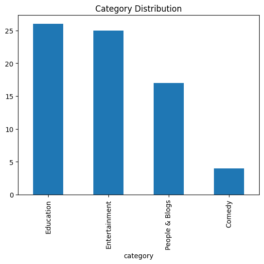
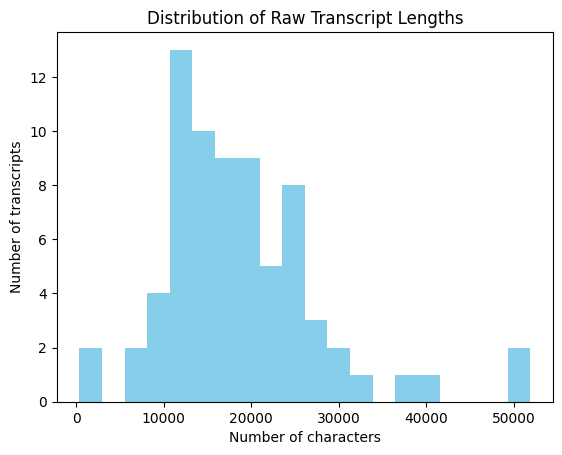
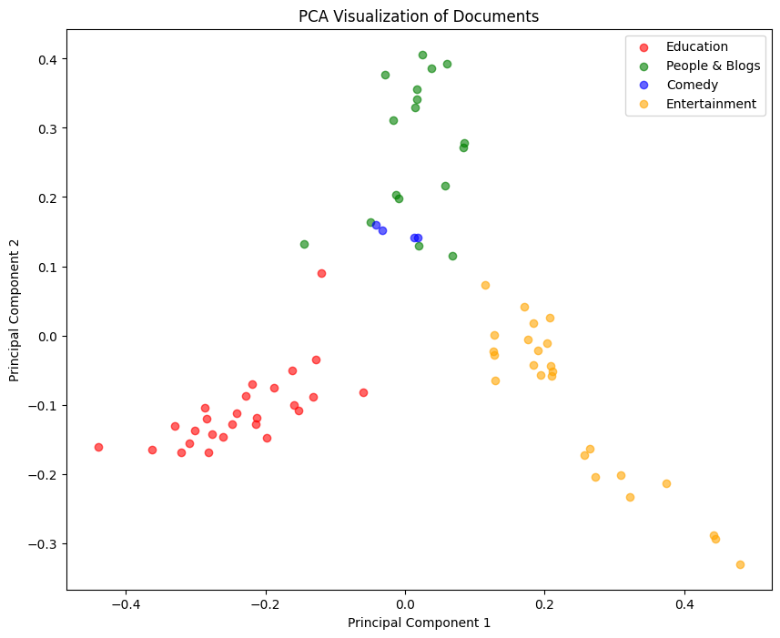
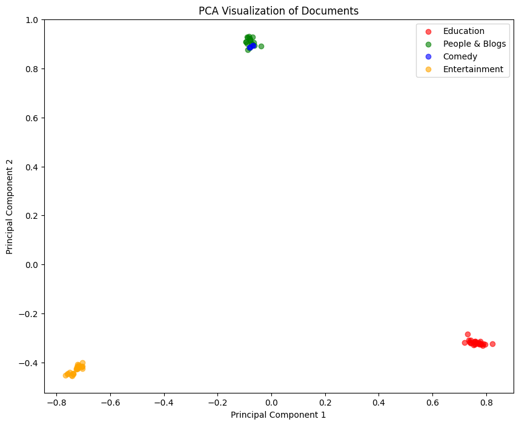
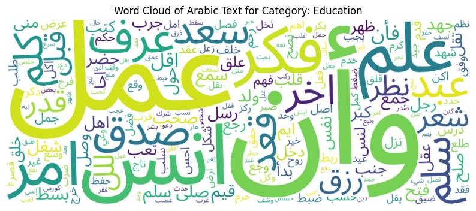
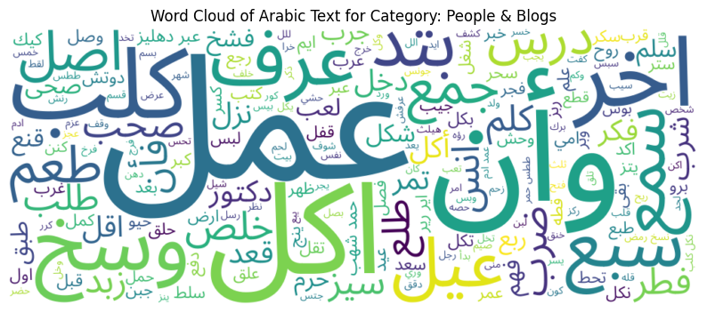
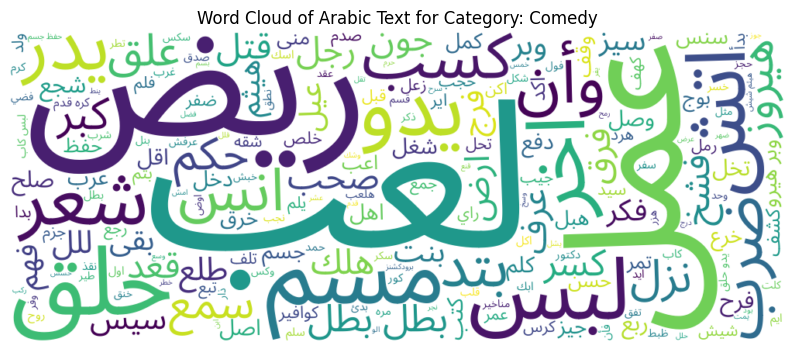
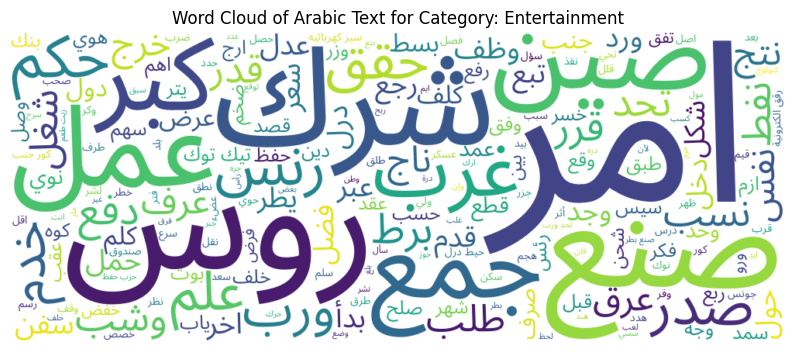

# NLP Project Milestone 1 Report – Data Analysis and Preprocessing

## 1. Introduction

**Objective:**  
This milestone focuses on exploring, cleaning, and preprocessing the dataset to prepare it for downstream NLP tasks such as text classification and topic modeling. Our dataset comprises 73 YouTube transcripts written in Arabic, featuring both Modern Standard Arabic (MSA) and Egyptian dialect elements. This report details our exploratory data analysis (EDA) and preprocessing pipeline, and discusses the insights gained and limitations encountered. 

**Our Approach and Rationale:**  
In our project, we decided to pursue a classification task focused on categorizing the transcripts. We selected this task because it allows us to leverage both metadata and textual content in a complementary way. Specifically, we use the channel information—which often provides context about the source and style of the content—as well as the most common words extracted from the transcripts. This combination helps capture not only the inherent topics within the text but also the contextual signals associated with specific channels. 

**Dataset Overview:**  
- **Number of Transcripts:** 73  
- **Metadata:** Each transcript comes with a title, channel, and category (with one transcript missing a category).  
- **Language Characteristics:** The text contains a mix of MSA and Egyptian dialect, with varying transcript lengths and diacritization levels.

---

## 2. Exploratory Data Analysis (EDA) – Raw Data

### 2.1 Data Structure and Quality
We began by examining the dataset’s overall structure to ensure it was suitable for further analysis. Using `df.info()`, we confirmed that our DataFrame consists of **73 rows** and **4 columns**: title, channel, category, and transcript. During this review, we noted the following:
- **Missing Values:** One transcript is missing its category, which will be addressed in subsequent preprocessing.
- **Duplicates:** We checked for and removed any duplicate records to ensure data integrity.

These initial checks are crucial to avoid biases and errors in the later stages of analysis.

### 2.2 Metadata Analysis

#### Category Distribution
Visualizing the distribution of transcripts across different categories revealed potential class imbalances. This insight is important, as imbalanced classes can affect model performance.

#### Transcript Distribution Across Channels
We also examined how transcripts are distributed by channel:
- **B Hodoo2:** 26 transcripts  
- **al mokhbir al eqtisadi:** 25 transcripts  
- **Kefaya Ba2a:** 21 transcripts  

This breakdown provides context on the source diversity and will later help in integrating metadata effectively.

#### Viewing Categories per Channel

We analyzed the distribution of categories within each channel:
- **B Hodoo2:** 1 category – Education  
- **Kefaya Ba2a:** 2 categories – People & Blogs, Comedy  
- **al mokhbir al eqtisadi:** 1 category – Entertainment  

  
This structure provides a strong metadata signal since channels with consistent content (e.g., B Hodoo2, al mokhbir al eqtisadi) can improve classification. However, it also indicates potential limitations in generalizability and bias due to channel-specific content and class imbalances.

### 2.3 Preliminary Text Analysis

#### Transcript Length
We computed the raw length of each transcript (in characters), which ranged from **930 to 51,920** characters, with a mean length of approximately **21,778** characters. This considerable variability suggests that normalization or segmentation may be necessary, particularly for very long texts.

A bar chart illustrating the distribution of transcript lengths helps visualize this variability:

#### Raw Text Sampling
Random sampling of transcripts was performed to inspect for encoding issues, extraneous whitespace, and formatting inconsistencies. This step confirmed that the raw data was largely clean, though it informed adjustments in our cleaning pipeline.

#### Word Frequency Analysis
A basic frequency analysis of the raw text revealed the most common words in the corpus. The top 10 words were:
- **في:** 5726  
- **انا:** 3823  
- **ما:** 3330  
- **اللي:** 3253  
- **ده:** 2993  
- **انت:** 2853  
- **من:** 2737  
- **ان:** 2699  
- **هو:** 2628  
- **يعني:** 2494  

This analysis guided the design of a custom stopword list, enabling us to remove high-frequency, low-information words.

#### Category-Specific Top Words
We further computed the most common words within each category:
- **Education:**  
  - في: 3018  
  - انا: 2115  
  - اللي: 1838  
  - ان: 1789  
  - من: 1780  

- **People & Blogs:**  
  - في: 2135  
  - انت: 1332  
  - انا: 1327  
  - ما: 1285  
  - هو: 1259  

- **Comedy:**  
  - في: 573  
  - ما: 399  
  - يا: 391  
  - انا: 381  
  - انت: 364  

These findings reveal that too many stop words need to be removed as it will affect our TF-IDF and task we wish to carry.

### 2.4 Purpose of Raw EDA
The raw EDA enabled us to:
- Confirm the structure and quality of the data.
- Understand the variability in transcript lengths.
- Identify common words and potential noise in the text.
- Analyze metadata distributions and class imbalances.

These insights have guided our preprocessing pipeline decisions, ensuring that subsequent steps in cleaning, tokenization, and feature extraction are well-informed by the intrinsic properties of the data.

## 3. Preprocessing Pipeline

Our preprocessing pipeline transforms the raw transcripts into a consistent, noise-reduced format for effective feature extraction.

### 3.1 Cleaning and Normalization

We implemented a multi-step cleaning process to prepare our raw transcripts for analysis:

- **Normalization of Arabic Letters:**  
  Variants of Arabic letters (e.g., converting "أ", "إ", "آ" to "ا" and "ى" to "ي") were normalized to reduce vocabulary variability.
  
- **Punctuation and Whitespace Cleaning:**  
  Extraneous punctuation—including both Latin and Arabic punctuation—is removed, and whitespace is standardized, ensuring that the text is clean and consistent for further processing.

### 3.2 Tokenization

We explored two approaches for tokenization:

- **Farasa Tokenization:**  
  We used Farasa for advanced tokenization, which effectively handles clitics and morphological segmentation in the Egyptian dialect. Post-processing steps were applied to remove segmentation markers (e.g., plus signs) to yield cleaner tokens.

- **BERT Tokenization (Exploratory):**  
  We also experimented with BERT tokenization using the `bert-base-multilingual-cased` model:
  

Upon manual inspection, we found that Farasa produced more satisfactory results for our dataset, particularly in capturing the nuances of the Egyptian dialect. Therefore, our pipeline relies on Farasa tokenization.

### 3.3 Stopword Removal

Initially, we applied NLTK’s Arabic stopword list—which is based on Modern Standard Arabic—to our tokenized text. This initial removal reduced the average token count per document. For example, across our dataset, the mean total tokens per document were 3684, and after applying the initial stopword removal, the mean token count dropped to 2822 The results of this initial stage are summarized in the table below:

| Mean total tokens | Mean tokens after initial stopword removal |
|-------------------|----------------------------------------------|
| 3684       | 2822                                  |

However, our subsequent TF-IDF analysis revealed that Egyptian dialect stopwords (e.g., "اللي") were still present. To further refine the process, we performed a statistical analysis by calculating document frequency and selecting the top 5% most frequent words as additional stopwords, supplementing them with manually added terms. This further reduction brought the mean token count down to 1277 per document. The table below summarizes the progressive reduction across all stages:

| Mean total tokens | Mean tokens after initial stopword removal | Mean tokens after additional stopword removal |
|-------------------|----------------------------------------------|-------------------------------------------------|
| 3684       | 2822                                 | 1277                                   |

This two-stage approach to stopword removal allowed us to progressively filter out uninformative tokens, ultimately leading to a more expressive feature set for our downstream tasks.

### 3.4 Named Entity Recognition (NER)

To preserve semantically critical information that might be lost during aggressive stemming, we implemented a Named Entity Recognition (NER) step in our preprocessing pipeline. This allows us to retain contextually significant entities like persons, locations, and organizations, which we will analyse further if they are crucial for downstream tasks classification.

### 3.5 Stemming and Lemmatization

In this section, we compare two approaches for morphological normalization: stemming and lemmatization. Our objective was to reduce vocabulary size while preserving semantic content for improved downstream performance in a text classification task.

**Methodology and Manual Inspection:**  
- **Stemming:** We applied the ISRIStemmer on the tokens (after additional stopword removal) to reduce them to their root forms. Manual inspection of a representative document shows that the stemming process aggressively reduces token forms, resulting in a more compact and normalized output.  
- **Lemmatization:** Using the CAMeL Tools Analyzer, we lemmatized the same set of tokens. This method retained more of the original word forms, capturing finer semantic nuances, but at the cost of a larger vocabulary.

**Manual Inspection**
For example, for one document:  
- The **original tokens** (after additional stopword removal) included words such as `['الانتاجيه', '500', 'قناه', 'وبحسبه', ...]`.  
- The **stemmed tokens** were significantly abbreviated (e.g., `['ناج', '500', 'قنه', 'حسب', ...]`).  
- The **lemmatized tokens** preserved more of the original form (e.g., `['الانتاجيه', '500', 'قناه', 'وبحسبه', ...]`).

**Vocabulary Size Comparison:**  
When we computed the vocabulary for the tokens after additional stopword removal, we obtained **35,014** unique tokens.Some of the most frequent tokens in this set were:
- ('الإنسان', 338)
- ('وأنا', 310)
- ('وأنت', 232)
- ('فأنا', 187)
- ('الآخر', 176)
- ('لالله', 171)
- ('أقول', 162)
- ('أكبر', 158)
- ('أعمل', 150)

After applying stemming, the vocabulary was significantly compressed to **10,109** unique tokens, whereas lemmatization did not affect the vocabulary size. This indicates that stemming offers a more compact representation.

**Baseline Model Evaluation:**  
We integrated both approaches into a baseline text classification pipeline using TF-IDF features and a logistic regression classifier. The evaluation metrics for both pipelines were nearly identical:
- **Accuracy:** 86.67%
- **Precision (weighted):** 88.83%
- **Recall (weighted):** 86.67%
- **F1-score (weighted):** 85.04%

The confusion matrices and detailed classification reports were also similar between the two methods.

**Conclusion:**  
Given that both stemming and lemmatization achieve comparable predictive performance, the choice between them comes down to efficiency and feature space compactness. Stemming significantly reduces the vocabulary size, which:
- Lowers computational complexity and speeds up training,
- Minimizes the risk of overfitting (particularly important given our relatively small dataset), and
- Streamlines the feature space without sacrificing classification accuracy.

Based on these results, our pipeline will favor **stemming** as the preferred approach for morphological normalization.

### 3.6 Feature and Target Encoding

To prepare our dataset for classification, we performed two key encoding steps: concatenating our input features and encoding our target labels.

#### Input Feature Concatenation

We first transformed the processed (stemmed) tokens into document strings and applied TF-IDF vectorization. This resulted in a TF-IDF matrix with dimensions **72 × 5000** (72 documents represented by 5000 features). In parallel, we encoded the channel metadata using one-hot encoding, which produced a matrix of dimensions **72 × 3**.

By concatenating these two matrices, we obtained our final input feature matrix of dimensions **72 × 5003**, which combines detailed textual information with contextual metadata.

| Component                   | Dimensions     | Description                                              |
|-----------------------------|----------------|----------------------------------------------------------|
| TF-IDF Matrix               | 72 × 5000      | Numerical representation of the processed text         |
| One-Hot Encoded Channel     | 72 × 3         | Binary encoding of the channel metadata                |
| **Final Input Matrix**      | **72 × 5003**  | Concatenated features used as input for classification   |

#### Target Label Encoding

For our classification task, the original category labels (e.g., "Education", "Entertainment", "People & Blogs", "Comedy") were encoded into numerical values using label encoding. This mapping converts each category into a unique integer that serves as the target variable for our models.

| Original Category Label | Encoded Label |
|-------------------------|---------------|
| Education               | e.g., 0      |
| Entertainment           | e.g., 1      |
| People & Blogs          | e.g., 2      |
| Comedy                  | e.g., 3      |

This target encoding enables our classification algorithms to process the labels numerically while preserving the mapping back to the original class names.

---

## 4. Post-Preprocessing Analysis

After completing our stemming-based preprocessing pipeline, we converted the cleaned stemmed tokens into document strings and generated a TF-IDF matrix using a vectorizer configured with a maximum of 5000 features and an n-gram range of (1,2). This process produced a matrix of shape **(72, 5000)**, where each of the 72 documents is represented by a 5000-dimensional vector.

To further enrich our feature set, we encoded the channel metadata using one-hot encoding. The resulting metadata matrix added 3 additional features per document. By concatenating the TF-IDF matrix with the one-hot encoded channel features, we obtained our final input matrix of shape **(72, 5003)**, which serves as the complete feature representation for our classification models.

### 4.1 TF-IDF Analysis

#### TF-IDF Analysis per Document

We began by examining the top TF-IDF scoring words in individual documents to evaluate how well our features capture salient content:

- In one document discussing the pain from love relationships, negative emotions, and the loss of motivation, the highest TF-IDF scores were:
  - **سقط:** 0.1924  
  - **الم:** 0.1862  
  - **اجتماعيه:** 0.1602  
  - **دعم:** 0.1520  
  - **نكد:** 0.1510  

  These scores indicate that the emotional and relational aspects are effectively captured.

- In another document focusing on career-related themes, the top scoring words were:
  - **هترضى:** 0.2264  
  - **وأن:** 0.1822  
  - **كارير:** 0.1806  
  - **شغل:** 0.1674  
  - **كورس:** 0.1550  

  Although a residual stopword ("وأن") appears, the presence of domain-specific terms such as **كارير** and **شغل** shows that our TF-IDF features capture relevant signals.

Overall, this per-document analysis suggests that our TF-IDF representation effectively highlights key document features, despite minor issues like a few remaining stopwords.

#### TF-IDF Analysis per Category

We further analyzed the TF-IDF representations on a per-category basis by generating separate TF-IDF matrices for each category. This allowed us to identify the most discriminative terms:

- **Education:**  
  Top scoring words include:
  - **عمل:** 0.1056  
  - **وأن:** 0.0922  
  - **انس:** 0.0889  
  - **علم:** 0.0604  
  - **فكر:** 0.0548  

  The appearance of **علم** (knowledge) is particularly fitting for educational content.

- **People & Blogs:**  
  Top terms are:
  - **عمل:** 0.0806  
  - **كلب:** 0.0561  
  - **فطر:** 0.0551  
  - **اكل:** 0.0517  
  - **وأن:** 0.0507  

  The persistence of the residual stopword **وأن** suggests that further stopword refinement may be beneficial for this category.

- **Comedy:**  
  Top scoring words include:
  - **لعب:** 0.2207  
  - **ريض:** 0.1605  
  - **مسم:** 0.1152  
  - **عمل:** 0.1085  
  - **حلق:** 0.0953  

  The recurrence of **عمل** indicates it may serve as a common root for several related words.

- **Entertainment:**  
  Top scoring words are:
  - **روس:** 0.1052  
  - **امر:** 0.1022  
  - **صنع:** 0.0461  
  - **صين:** 0.0455  
  - **نفط:** 0.0379  

  These terms reflect the geopolitical and economic themes typical of entertainment content.

### 4.2 Visualizations Using PCA

To further assess our feature extraction and preprocessing, we applied Principal Component Analysis (PCA) to reduce our high-dimensional data for visualization.

#### PCA on TF-IDF Features Alone

We applied PCA to the TF-IDF matrix (5000 features) to project the data into a 2D space. The scatter plot below shows the document distribution based solely on textual content:

*Observations:*  
- The **Education** and **Entertainment** clusters are well separated, suggesting clear lexical differences between these categories.
- In contrast, **People & Blogs** and **Comedy** exhibit significant overlap, possibly due to shared colloquial language or thematic similarities.

#### PCA on Combined Features (TF-IDF + Channel Metadata)

We then concatenated the one-hot encoded channel metadata (3 features) with the TF-IDF features to form a final input matrix of shape **(72, 5003)**. Applying PCA to this combined feature set produced the scatter plot below:

*Observations:*  
- The addition of channel metadata further enhances the separation between **Education** and **Entertainment**, indicating that channel information provides valuable contextual cues.
- However, the overlap between **People & Blogs** and **Comedy** becomes even more pronounced, likely due to similar channel characteristics across these categories.

These PCA visualizations demonstrate that while TF-IDF features alone capture significant differences in document content, incorporating metadata can alter the feature space—improving separation for some categories while increasing overlap for others.

---

### 4.3 Word cloud visualization

- **Education:**  
    
  *Comment:* This word cloud emphasizes terms such as "عمل" and "علم," reflecting a focus on educational and productivity themes. The prominence of these words suggests that content in this category centers on learning and academic topics.

- **People & Blogs:**  
    
  *Comment:* The word cloud for People & Blogs reveals everyday language with frequent terms like "عمل" and "اكل." These recurring words indicate discussions related to daily life and personal experiences.

- **Comedy:**  
    
  *Comment:* In the Comedy category, words like "لعب" dominate the cloud, suggesting a playful, informal tone. This visual confirms that humorous content is characterized by lighter, entertaining language.

- **Entertainment:**  
    
  *Comment:* The Entertainment word cloud features terms like "امر" and "صنع," indicating content that revolves around events, production, and broader socio-political narratives. The vocabulary here aligns with the thematic focus on news and cultural events.

  #### 4.4 N-gram Analysis per Category

To further explore the linguistic patterns within our dataset, we extracted bigrams and trigrams from the processed text separately for each category. This analysis helps reveal common phrases and domain-specific collocations that may not be as evident when considering unigrams alone. Below are the top 5 most frequent n-grams for each category along with key observations.

**Education:**  
- *Bigrams:*  
  - ('صلى', 'سلم') – 110 occurrences  
  - ('عمل', 'عمل') – 24 occurrences  
  - ('صدق', 'صدق') – 24 occurrences  
  - ('رسل', 'صلى') – 22 occurrences  
  - ('وأن', 'وأن') – 15 occurrences  

- *Trigrams:*  
  - ('رسل', 'صلى', 'سلم') – 21 occurrences  
  - ('صدق', 'صدق', 'صدق') – 7 occurrences  
  - ('غفر', 'ابا', 'بكر') – 6 occurrences  
  - ('بسط', 'لمن', 'يشء') – 6 occurrences  
  - ('حفظ', 'حفظ', 'حفظ') – 5 occurrences  

*Observations:*  
The Education category shows a strong presence of repetitive and formal phrases, such as ('صلى', 'سلم') and ('رسل', 'صلى', 'سلم'), which could reflect traditional or ceremonial language. The repetition in phrases like ('صدق', 'صدق') also suggests emphasis on reliability or truth, aligning with the theme of education and knowledge.

**People & Blogs:**  
- *Bigrams:*  
  - ('عبر', 'دهليز') – 38 occurrences  
  - ('حمد', 'شهب') – 33 occurrences  
  - ('اير', 'رير') – 25 occurrences  
  - ('نسخ', 'رمض') – 24 occurrences  
  - ('ططس', 'حمر') – 23 occurrences  

- *Trigrams:*  
  - ('كلب', 'حمد', 'شهب') – 10 occurrences  
  - ('نسخ', 'رمض', 'نسخ') – 8 occurrences  
  - ('رمض', 'نسخ', 'أصحاب') – 8 occurrences  
  - ('نسخ', 'أصحاب', 'قلب') – 8 occurrences  
  - ('أصحاب', 'قلب', 'يحس') – 8 occurrences  

*Observations:*  
In People & Blogs, the n-gram analysis suggests a mix of everyday conversational language and possibly stylistic idiosyncrasies. For example, the appearance of ('عبر', 'دهليز') may indicate informal metaphoric expressions, while the repeated phrases in the trigrams hint at recurring themes or opinions shared among bloggers.

**Comedy:**  
- *Bigrams:*  
  - ('بطل', 'بطل') – 22 occurrences  
  - ('وبر', 'هيرو') – 11 occurrences  
  - ('كره', 'قدم') – 9 occurrences  
  - ('لعب', 'ريض') – 8 occurrences  
  - ('يدو', 'حلق') – 8 occurrences  

- *Trigrams:*  
  - ('بطل', 'بطل', 'بطل') – 14 occurrences  
  - ('دام', 'سوز', 'نام') – 5 occurrences  
  - ('بعد', 'بعد', 'بعد') – 5 occurrences  
  - ('بسط', '18', 'ويز') – 4 occurrences  
  - ('سبت', '7', ':') – 4 occurrences  

*Observations:*  
The Comedy category is characterized by playful and repetitive expressions, as seen in the dominance of ('بطل', 'بطل') in both bigrams and trigrams. Such repetition may contribute to a humorous effect and reflect the informal, exaggerated style typical of comedic content.

**Entertainment:**  
- *Bigrams:*  
  - ('تيك', 'توك') – 50 occurrences  
  - ('سير', 'كهربائيه') – 37 occurrences  
  - ('كور', 'جنب') – 36 occurrences  
  - ('رقق', 'الكترونية') – 34 occurrences  
  - ('حيط', 'درل') – 34 occurrences  

- *Trigrams:*  
  - ('حظر', 'تيك', 'توك') – 20 occurrences  
  - ('صندوق', 'نمه', 'عرق') – 16 occurrences  
  - ('زيت', 'عبد', 'شمس') – 13 occurrences  
  - ('بنك', 'حيط', 'درل') – 12 occurrences  
  - ('وزر', 'خزن', 'امر') – 12 occurrences  

*Observations:*  
The Entertainment category shows a focus on phrases that hint at technological or economic themes (e.g., ('تيك', 'توك'), ('سير', 'كهربائيه')). These expressions likely relate to discussions of media production, trends, or current events. The presence of terms like ('زيت', 'عبد', 'شمس') might reflect specific references or titles prevalent within this content.

---

Overall, the n-gram analysis serves as a diagnostic tool that:
- **Validates Preprocessing:** Confirming that our cleaning and tokenization steps produce coherent phrases.
- **Reveals Domain-Specific Language:** Highlighting common collocations that characterize each category.
- **Guides Future Feature Engineering:** Suggesting potential adjustments to the n-gram range or even the incorporation of key multi-word expressions as additional features.

These insights can help refine our processing pipeline and inform enhancements for future iterations of our text classification model.

#### 4.5 Classification Model Validation

To validate our preprocessing pipeline, we built a baseline logistic regression model using our final feature set—the concatenated TF-IDF features (5000 dimensions) and one-hot encoded channel metadata (3 dimensions), resulting in an input matrix of shape **(72, 5003)**. We split the data into training and testing sets (70% train, 30% test) and trained the model with 1000 iterations.

The model achieved an accuracy of **95.45%** on the test set. The classification report shows that while the Education, Entertainment, and People & Blogs categories are well-classified, the Comedy category did not have any predicted samples (which is reflected in a precision, recall, and F1-score of 0 for that class). 

Our primary objective for this milestone was not to optimize model performance but to demonstrate that our preprocessed data is suitable for downstream classification tasks. The high overall accuracy indicates that the transformed features capture meaningful distinctions in the data, confirming the efficacy of our preprocessing pipeline.

#### 4.6 Entity Token Value Analysis Per Category

**Comedy**  
- **Top Entities**: ميدو (41), هيثم (19), هيروز (7), سوبر (5), شيشه (5)  
- **Issues**:  
  - Most entities are informal nicknames (e.g., "ميدو") or fictional terms ("هيروز") with no real-world significance.  
  - "سوبر" (super) and "شيشه" (hookah) are generic terms unrelated to comedic themes.  
  - No alignment with humor-specific entities (e.g., jokes, satire).  

**Education**  
- **Top Entities**: بكر (24), نوح (14), الإسلام (11), صلى (8)  
- **Issues**:  
  - Religious/historical terms ("بكر," "نوح") are overly broad and fail to capture educational content (e.g., "math," "science").  
  - "يوتيوب" (YouTube) is a platform, not an educational concept.  
  - Entities lack specificity (e.g., "بن" means "son" and is contextually meaningless).  

**Entertainment**  
- **Top Entities**: أمريكا (34), روسيا (29), الاحتياطي (28), توشيبا (17)  
- **Issues**:  
  - Geopolitical terms ("أمريكا," "روسيا") dominate but are irrelevant to entertainment themes (e.g., movies, music).  
  - Technical terms like "الاحتياطي" (reserve) and brands ("توشيبا") add noise without thematic relevance.  

**People & Blogs**  
- **Top Entities**: أحمد (40), كيك (25), بيتزا (10), تشيز (19)  
- **Issues**:  
  - Generic personal names ("أحمد") dominate, offering no contextual insight.  
  - Food-related terms ("كيك," "بيتزا," "تشيز") suggest recipe content but conflict with the category’s broad scope.  
  - No alignment with blog-specific themes (e.g., lifestyle, travel).  

#### 4.7 Entity Type Analysis Per Category  

**Comedy**  
- **Dominant Types**: `B-MISC` (184), `B-PERS` (155), `I-PERS` (66)  
- **Issues**:  
  - High `B-MISC` (miscellaneous entities) suggests vague or non-thematic terms (e.g., slang, fictional references).  
  - `B-PERS` includes informal nicknames (e.g., "ميدو") rather than meaningful figures.  
  - Minimal `B-LOC`/`B-ORG` signals irrelevance to comedic themes.  

**Education**  
- **Dominant Types**: `B-PERS` (232), `B-MISC` (173)  
- **Issues**:  
  - `B-PERS` includes historical/religious figures (e.g., "نوح"), which are too broad for educational content.  
  - `B-MISC` likely captures generic terms (e.g., "يوتيوب") instead of domain-specific concepts.  
  - Negligible `B-LOC`/`B-ORG` fails to reflect academic institutions or topics.  

**Entertainment**  
- **Dominant Types**: `B-LOC` (1233), `B-ORG` (618), `B-PERS` (583)  
- **Issues**:  
  - Overwhelming `B-LOC` (geopolitical terms like "أمريكا") and `B-ORG` (organizations like "الاحتياطي") are too generic for entertainment themes.  
  - High `B-PERS` includes public figures but lacks alignment with media or cultural content.  
  - Dominance of these types likely reflects dataset bias (e.g., news-like content miscategorized as entertainment).  

**People & Blogs**  
- **Dominant Types**: `B-MISC` (652), `B-PERS` (358)  
- **Issues**:  
  - `B-MISC` dominates with ambiguous terms (e.g., "كيك," "بيتزا"), unrelated to blogging themes.  
  - `B-PERS` includes common names ("أحمد") without contextual relevance.  
  - Low `B-LOC`/`B-ORG` fails to capture travel or institutional narratives.

## Limitations

- **Small Dataset Size:**  
  Our dataset consists of only 73 documents, which is insufficient for robust generalization. This increases overfitting risks and limits the model's ability to capture linguistic diversity in real-world scenarios.

- **Dialectal Variations in Egyptian Arabic:**  
  Standard NLP tools (e.g., stemmers, lemmatizers) are optimized for Modern Standard Arabic (MSA) and struggle with Egyptian dialect-specific vocabulary, morphology, and clitics. Manual interventions (e.g., custom stopword lists) are error-prone and time-consuming.

- **Class Imbalance:**  
  Severe imbalance exists, particularly in the Comedy category (4 documents). This skews model training and evaluation, leading to inflated performance metrics for majority classes (e.g., Education, Entertainment) and poor generalization for underrepresented classes.

- **Preprocessing Artifacts:**  
  Aggressive stemming (e.g., ISRIStemmer) strips words to overly simplified roots, erasing meaningful distinctions (e.g., "القاهرة" → "قاه"). Residual stopwords and tokenization artifacts (e.g., Farasa’s segmentation markers) introduce noise into feature representations.

- **Annotation Quality and Consistency:**  
  Categories are derived from metadata (e.g., YouTube channel labels), which may misalign with actual content themes. For example, "Entertainment" could include geopolitical discussions, introducing label ambiguity.

- **Limited Contextual Features:**  
  TF-IDF with n-grams captures surface-level patterns but fails to model semantic relationships or context, unlike transformer-based embeddings (e.g., BERT). This limits performance on nuanced classification tasks.

- **Data Leakage Risk:**  
  Small dataset size increases the likelihood of overlapping vocabulary or thematic overlap between training and test splits, artificially inflating model accuracy.

- **Domain Generalization:**  
  The model is tailored to YouTube transcripts and may struggle with text from other platforms (e.g., tweets, news articles) due to differences in structure, formality, and vocabulary.

- **Interpretability Trade-offs:**  
  While logistic regression with TF-IDF offers interpretability, future use of complex models (e.g., neural networks) would sacrifice transparency for potential gains in accuracy.

## 6. Conclusion

In this milestone, we conducted a comprehensive analysis and developed a robust preprocessing pipeline for our Arabic YouTube transcripts. Our work involved cleaning, tokenizing, and transforming the data into a TF-IDF representation, which was then enriched with channel metadata to form the final input features. Through detailed TF-IDF analysis, PCA visualizations, and n-gram evaluations, we confirmed that our features capture meaningful distinctions among categories. However, limitations such as the small dataset size, challenges with processing the Egyptian dialect, and class imbalance underscore the need for further refinement. Future work will focus on addressing these issues and enhancing our feature extraction for improved classification performance.

